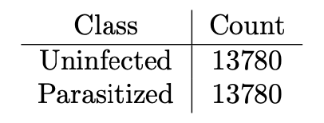
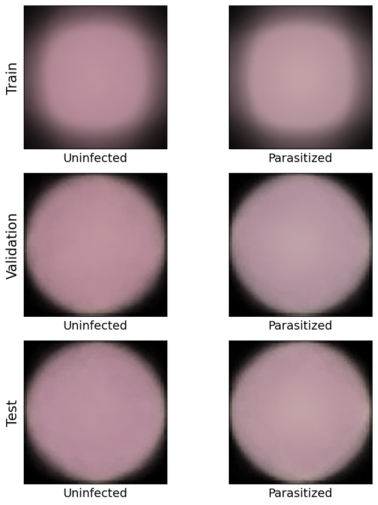

# Detection of Malaria Infection in Human Cells

Malaria is a deadly disease caused by parasites that are transmitted to humans through the bites of infected mosquitoes. In 2021 alone, there were an estimated 250 million cases of malaria worldwide, resulting in over 600,000 fatalities. Early detection of infected cells is critical to preventing disease progression and alerting health officials of potential outbreaks within a region.

Automating the classification of human cells as diseased or uninfected can facilitate early and accurate detection, particularly in cases where subtle indicators of disease are present. Therefore, **the aim of this project is to develop a deep learning model for detecting malaria infection in human cells**. The model will be trained on a dataset of images of infected and healthy cells, utilizing convolutional neural networks (CNNs) to learn features from the images and accurately classify them as infected or healthy. Ultimately, this tool could aid in the timely and effective diagnosis and treatment of malaria, potentially saving countless lives.

The source code is available [here](https://github.com/amelialwx/Malaria-Detection/blob/main/code/malaria_detection.ipynb) for reference.

## Table of Contents
- [Data Preprocessing](https://github.com/amelialwx/Malaria-Detection/tree/main#Data-Preprocessing)
- [Train-test split](https://github.com/amelialwx/Malaria-Detection/tree/main#Train-test-split)
- [EDA](https://github.com/amelialwx/Malaria-Detection/tree/main#EDA)
    - [Class imbalance](https://github.com/amelialwx/Malaria-Detection/tree/main#Class-imbalance)
    - [Visualize the random samples](https://github.com/amelialwx/Malaria-Detection/tree/main#Visualize-the-random-samples)
    - [Deeper understanding of the data](https://github.com/amelialwx/Malaria-Detection/tree/main#Deeper-understanding-of-the-data)
    - [Pixel intensity for each class](https://github.com/amelialwx/Malaria-Detection/tree/main#Pixel-intensity-for-each-class)
    - [Pixel intensity for each color channel for each class](https://github.com/amelialwx/Malaria-Detection/tree/main#Pixel-intensity-for-each-color-channel-for-each-class)
- [Dimensionality Reduction: RGB to Grayscale](https://github.com/amelialwx/Malaria-Detection/tree/main#Dimensionality-Reduction-RGB-to-Grayscale)
    - [Brightening the background](https://github.com/amelialwx/Malaria-Detection/tree/main#Brightening-the-background)
- [Dimensionality Reduction: Principal Component Analysis](https://github.com/amelialwx/Malaria-Detection/tree/main#Dimensionality-Reduction-Principal-Component-Analysis)
- [PCA and t-SNE on Grayscaled Images](https://github.com/amelialwx/Malaria-Detection/tree/main#PCA-and-t-SNE-on-Grayscaled-Images)
    - [PCA on grayscaled images](https://github.com/amelialwx/Malaria-Detection/tree/main#PCA-on-grayscaled-images)
    - [t-SNE of grayscaled images](https://github.com/amelialwx/Malaria-Detection/tree/main#t-SNE-of-grayscaled-images)
- [PCA and t-SNE on Colored Images](https://github.com/amelialwx/Malaria-Detection/tree/main#PCA-and-t-SNE-on-Colored-Images)
    - [PCA on colored images](https://github.com/amelialwx/Malaria-Detection/tree/main#PCA-on-colored-images)
    - [t-SNE of colored images](https://github.com/amelialwx/Malaria-Detection/tree/main#t-SNE-of-colored-images)
- [Baseline Models](https://github.com/amelialwx/Malaria-Detection/tree/main#Baseline-Models)
    - [Baseline Model - Logistic Regression on Grayscaled Images](https://github.com/amelialwx/Malaria-Detection/tree/main#Baseline-Model---Logistic-Regression-on-Grayscaled-Images)
    - [Baseline Model - Logistic Regression on Colored Images](https://github.com/amelialwx/Malaria-Detection/tree/main#Baseline-Model---Logistic-Regression-on-Colored-Images)
    - [Baseline Model - Logistic Regression on Grayscaled Images](https://github.com/amelialwx/Malaria-Detection/tree/main#Baseline-Model---Logistic-Regression-on-Grayscaled-Images)
    - [Baseline Model - Support Vector Machine on Grayscaled Images](https://github.com/amelialwx/Malaria-Detection/tree/main#Baseline-Model---Support-Vector-Machine-on-Grayscaled-Images)
    - [Baseline Model - Support Vector Machine on Colored Images](https://github.com/amelialwx/Malaria-Detection/tree/main#Baseline-Model---Support-Vector-Machine-on-Colored-Images)
    - [Baseline Model - Conclusion](https://github.com/amelialwx/Malaria-Detection/tree/main#Baseline-Model---Conclusion)
- [CNN Model](https://github.com/amelialwx/Malaria-Detection/tree/main#CNN-Model)
    - [CNN Model Without Tuning](https://github.com/amelialwx/Malaria-Detection/tree/main#CNN-Model-Without-Tuning)
- [Final CNN Model With Tuning](https://github.com/amelialwx/Malaria-Detection/tree/main#Final-CNN-Model-With-Tuning)
- [Conclusion & Future Work](https://github.com/amelialwx/Malaria-Detection/tree/main#Conclusion--Future-Work)
- [References](https://github.com/amelialwx/Malaria-Detection/tree/main#References)
- [Author](https://github.com/amelialwx/Malaria-Detection/tree/main#Author)

## Data Preprocessing
The dataset that we explored consists of human cell images that we obtained from the [NIH website](https://lhncbc.nlm.nih.gov/LHC-downloads/downloads.html#malaria-datasets). The dataset includes two folders, one for uninfected human cell images and another for malaria-infected human cell images. There are a total of 27560 images with 13780 images in each folder. These images have different sizes, so we resized them all to a uniform 128 × 128 × 3 pixels.

To further preprocess the data images, further data scaling and data augmentation is used. Normalizing the pixel values to the range [0, 1] helps improve the convergence speed and the performance of the neural network during training. Data augmentation will allow the models to perform better on unseen data and increase robustness. Therefore, the pixel values of the images are also normalized to the range [0, 1] by dividing all pixel intensities by 255.0. The images are also augmented with rotation, zoom, flip, and fill via `ImageDataGenerator`.

Rotation: randomly rotates the images by an angle within this range. This helps the model become invariant to rotation, which is important for classifying images with different orientations.

Zoom: randomly zooms the images by a factor 0.15 within this range. This helps the model become invariant to scale, which is important for classifying objects of different sizes.

Flip: images are flipped horizontally and vertically, which reflect the images along the horizontal and vertical axes, respectively. This helps the model become invariant to the orientation of the object within the image.

Fill: fill_mode of 'constant' and a cval of 0 are used to fill any empty pixels that are created during the transformation process with zeros. This helps ensure that the transformed images have the same dimensions as the original images.

## Train-test split
The dataset is split into 3 sets: train, validation, and test at an 80%, 12%, and 8% split respectively. The number of images in each set is shown in the following table.

## EDA

### Class imbalance
To investigate class imbalance of the dataset, the images that belong to each class are counted. There are no data missingness or class imbalance issues present because 1. this project is dealing with images and 2. a complete dataset is available for both uninfected and parasitized cell images. An equal amount of images in each class also ensures perfect class balance.

### Visualize the random samples
The `ImageDataGenerator` objects are converted to `NumPy` arrays for further data exploration. Below are visualizations of randomly sampled images from both the normalized and augmented images from the training, validation, and test set respectively.

### Deeper understanding of the data
Due to memory limit, only 30% of the images from each dataset are sampled for EDA. The new distribution for each smaller dataset is shown in the following figure.

### Pixel intensity for each class
One of the goals of this project is to determine whether color plays an important role in classifying a cell as uninfected or parasitized. 

THe pixels across the cell images of uninfected and parasitized cells are averaged for the smaller train, validation, and test datasets to visualize the average appearance of these cells.

### Pixel intensity for each color channel for each class
The pixel intensity per color channel for the uninfected and parasitized cells across the first 30% of cell images for train, validation, and test data sets are also analyzed to identify whether and which color channel is the deciding factor in differentiation the parasitized cells from the uninfected ones. The distribution is visualized below.

The visualization clearly shows some interesting patterns. Specifically, the peak of the green channel for the parasitized cells is higher than that of the uninfected cells for all three datasets. Additionally, the peak of the green channel for the parasitized cells is higher than the first blue channel peak, whereas for the uninfected cells, the peak of the green channel aligns with the first blue channel peak. These findings suggest that the green channel may be more informative in distinguishing between infected and uninfected cells, particularly for parasitized cells.

Below is the table of average pixel intensity per color channel for uninfected and parasitized cells across the first 30% of cell images for train, validation, and test data sets. 

The table shows that the average pixel intensity values for parasitized cells are generally higher than those for uninfected cells, regardless of the color channel or dataset. This finding is consistent across all three color channels and is particularly pronounced for the green channel. These results confirm what was observed in the earlier histogram analysis, which suggested that the green channel may be a more important feature for distinguishing between the two classes. The color channels may play a critical role in identifying parasitized cells, and this information can potentially be leveraged to improve the performance of machine learning models for malaria detection.

To make the average pixel intensity data more easily interpretable, a bar chart has been plotted.

## Dimensionality Reduction: RGB to Grayscale
After analyzing the pixel intensity values of each color channel for the uninfected and parasitized cells across all three datasets, it appears that the differences are quite small but could still have an impact on the model's performance. To determine the significance of retaining color information, experimenting with transforming the images in the train and validation sets into grayscale can be performed. By comparing the performance of the baseline models on the grayscale images with the performance on the original color images, the importance of color for the malaria detection task can be evaluated and determine whether it should be retained in the final model.

### Brightening the background
The background of the grayscale images is also brightened by setting the pixel values outside of the cells to the largest pixel value present in the image to ’brighten’ the background. This step ensures that the model will only focus on the pixels inside the cells, which is expected to help with the classification of grayscale images.

## Dimensionality Reduction: Principal Component Analysis
Since the dataset is large, it would be of best interest to reduce the dimensionality of the dataset to achieve higher training efficiency. Hence, PCA is first on the full training data.

The idea behind PCA is to identify the underlying structure in the data and summarize it using a smaller set of variables that capture most of the variation in the data. The first principal component accounts for the most variation in the data, followed by the second, and so on.

## PCA and t-SNE on Grayscaled Images
### PCA on grayscaled images

The first 32 principal components are only able to explain approximately 46% of the total variance within the training data.

The first 16 principal components and their corresponding explained variance ratios are visualized below.

### t-SNE of grayscaled images
This project will be utilizing t-SNE (t-distributed stochastic neighbor embedding) as a technique for visualizing the high-dimensional PCA transformed train data in two dimensions. t-SNE is a powerful tool for identifying structure in complex datasets and can help to determine the effectiveness of the models for malaria detection.

t-SNE and PCA have different approaches to preserving the structure of high-dimensional data. While PCA aims to maximize variance by preserving the large pairwise distances between data points, t-SNE is focused on preserving the small pairwise distances or local similarities between nearby points. This allows t-SNE to capture more subtle, non-linear relationships between the data points, which can be particularly useful for visualizing complex datasets. 

The resulting t-SNE plot shows two clusters of data points, corresponding to the two classes: uninfected (green) and parasitized (red). The plot allows us to see how the data is distributed and to identify any patterns or relationships between the data points.

By visualizing the data in this way, it is possible to get a sense of how well the PCA transformation has captured the key features of the data and how well the models are able to classify the different classes. t-SNE can also be used to compare the performance of different models and to identify any areas where further improvement may be necessary.

In this case, the t-SNE plot provides some important insights into the effectiveness of the PCA transformation. The two clusters of data points, corresponding to the uninfected and parasitized classes, appear to be heavily overlapping in the t-SNE plot, with many points from the uninfected class scattered throughout the parasitized cluster.

This suggests that the PCA transformation may not be capturing all of the relevant features that allow for accurate classification of the data, and that further feature engineering or alternative dimensionality reduction techniques may be necessary to improve the performance of the logistic regression model and SVM model. 

## PCA and t-SNE on colored images
### PCA on colored images
The first 32 principal components were able to explain 71.2% of the variance within the colored training dataset.

The first 16 principal components and their corresponding explained variance ratios are visualized below.

### t-SNE of colored images

Similar to the tSNE analysis on the grayscale images, the 2 clusters of the colored images also havily overlap each other. This suggests that the PCA transformation may not be capturing all of the relevant features that allow for accurate classification of the colored data as well.

## Baseline Models
### Baseline Model - Logistic Regression on Grayscaled Images
For the first baseline model does not involve a neural network, a classification using logistic regression is performed with the first 32 principal components. Validation accuracy and confusion matrix were computed. The accuracy of the model is around 50%.

### Baseline Model - Logistic Regression on Colored Images
The same model is then trained on colored images to see whether the validation accuracy will be improved. The validation accuracy returned by the model is 64.3%, which is a moderate improvement from the one trained on grayscale images.

### Baseline Model - Support Vector Machine on Grayscaled Images
As a second baseline model that does not involve neural network, a classification using support vector machine is performed. 

SVMs search for a hyperplane in a space with many dimensions that can divide the input data into different categories. The hyperplane is picked to have the largest margin, which is the distance between the hyperplane and the nearest data points from each category. Once found, this hyperplane is used by the SVM algorithm to classify new data points.

The motivation for choosing SVMs is due to their capability to process data that cannot be separated linearly by changing the input space to a higher-dimensional one where linear separation becomes feasible. This is accomplished using a kernel function that maps the initial input space to a higher-dimensional space with additional features. As parasitized cells can have a range of appearances in blood smears and may not be easily distinguishable from uninfected cells, it is possible that SVMs could be effective in identifying patterns and features in the data that may be indicative of parasitized cells.

The validation accuracy came to be around 50%. The confusion matrix were computed as was previously done in logistic regression case. 

### Baseline Model - Support Vector Machine on Colored Images
Similar to logistic regression, the SVM model is also trained on colored images. Again, there is an improvement in model accuracy as the validation accuracy obtained on colored images is 69.7%.

### Baseline Model - Conclusion
The baseline models, logistic regression and SVM trained on grayscaled images yielded roughly 50% validation accuracy, respectively. These results indicate that the models are not much better than random guessing, or may even perform worse. There are several possible reasons for these observations. Firstly, the data is highly dimensional, so the logistic regression model, which utilized only 32 principal components, might be too simplistic for accurate prediction. Additionally, during the dimensionality reduction step (in which we converted images to grayscale and performed PCA), key color information might have been lost. Since the 32 principal components explain only 46% of the total variance, it is highly likely that features which differentiate the two classes (Uninfected and Parasitized) are located in the principal components that explain smaller variances and were thus not included in the baseline model. 

On the other hand, with colored images, the two baseline models were able to obtain higher validation accuracies of 64.3% and 69.7%, respectively.

From the 2 baseline models above, it is clear that color does play a significant role in model performance as it contains vital information about features of cell images. Hence the images cannot be reduced in dimensionality by turning them into grayscale images. From now on, the models will be trained on colored images.

## CNN Model
As a starting point for the final model, a simple CNN model can be used. The CNN is trained on RGB images rather than grayscale images. This is due to the earlier conclusion from the baseline model that crucial features that distinguish uninfected and parasitized cells are highly likely to be lost during dimensionality reduction. With this CNN model as a starting point, hyperparameter tuning is performed to improve the performance.

### CNN Model Without Tuning
To start, a simple CNN model was designed with 2 convolutional layers, each followed by a Maxpooling layer to extract only the most salient features. Then, the outputs were flattened, 1 fully-connected dense layer was added, and the data was batch-normalized to avoid exploding gradients. Finally, the model performed the classification task by passing the data through a sigmoid activation function. The architecture and flowchart of the model is shown below.

The model was trained for 10 epochs but included early stopping with a patience of 3 epochs. If the validation accuracy does not increase after 3 epochs, the training will be terminated and the best trained weights will be restored. The model was trained on 30% of the full training dataset.

Based on the training history for the baseline CNN model, it is clear that the training loss steadily decreases and training accuracy continuously increases. On the other hand, the validation loss and accuracy fluctuate throughout the training process. It is clear that the baseline CNN model requires fine-tuning. The test accuracy of this model is 0.81. 

The t-SNE plot of the base CNN model without tuning provides some initial insights into the separability of the uninfected and parasitized classes in the dataset. While the two clusters of data points do show some degree of separation, with the uninfected points generally clustering on the right side of the plot and the parasitized points on the left, there is still a significant amount of overlap in the middle of the plot. This suggests that the model is not yet able to fully distinguish between the two classes based on the available features and training. 

One possibility for this lack of separation is that the features that the CNN model is using to differentiate between the two classes may be more strongly correlated with t-SNE Component 1 than with Component 2. This means that the differences between the uninfected and parasitized points may be more apparent in the horizontal axis of the plot than in the vertical axis. 

Another possible explanation is that the lack of tuning in the base CNN model has limited its ability to fully separate the classes. By adjusting parameters such as the learning rate, adding more layers, and adding dropout, it may be possible to improve the model's performance and achieve greater separation between the clusters. 

For the untuned CNN model, the confusion matrix is as shown below. The false positive and false negative rates are 14.3% and 24.2%, respectively. The model struggles with false negative cases the most, where the cells are classified as healthy while they are in truth parasitized. 

## Final CNN Model With Tuning
Several steps were taken to fine-tune the CNN model. First, the model complexity was increased by adding two more convolutional layers to extract more features from the training data. Dropout layers were then added after each maxpooling layer and the dropout rate was tuned to prevent the model from overfitting. It was found that setting the dropout rate to 0.2 provided the best accuracy. The learning rate of the optimizer was also increased to 0.0005 so that the model is less likely to get stuck in a gradient valley.

Similar to the baseline CNN model, the tuned model was trained for 10 epochs. Early stopping with a patience of 3 epochs was applied. If the validation accuracy does not increase for 3 epochs, the training would be terminated and the best trained weights would be restored.

Finally, the model was trained on the full training dataset instead of using only 30% so that the model has more information to learn from.

The architecture and flowchart of the model is shown below.

From the plots for the training history, both losses and accuracies for the training and validation converge as the number of epochs increases, which means that the model is not overfitting to the training data. The test accuracy of the tuned CNN model is 0.96.

From the plots for the training history, both losses and accuracies for the training and validation converge as the number of epochs increases, which means that the model is not overfitting to the training data. The test accuracy of the tuned CNN model is 0.96.

The t-SNE plot of the second CNN with tuning reveals that the model is able to more effectively separate the uninfected and parasitized classes in the dataset. The two clusters of data points are more distinct than in the base CNN model. However, there is still a section in the middle of the plot where the two clusters overlap, indicating that there may be some degree of similarity between the two classes the first t-SNE component is struggling to capture.

The improvement of the separation with the new CNN model is most likely attributed to the tuning performed, which allowed it to better identify and utilize the most relevant features for distinguishing between the two classes. By adjusting parameters such as the learning rate, number of layers, adding dropout, batch normalization, and increasing the depth of the CNN, the model may have been able to more effectively learn the distinguishing characteristics of the uninfected and parasitized cells, leading to better separation in the t-SNE plot.

The final model was able to perform the task of differentiating the infected cells from healthy ones with a 96% accuracy. The false positive and negative rates are significantly improved from the untuned CNN model. However, it still yields a 3.6% false negative rate and 5.7% false positive rate. The false negative cases are definitely considered more dangerous in this scenario because the cell images that are in truth infected by malaria will not be correctly classified by the model. In other words, 36 people out of 1000 who are actually plagued by malaria will not test positive using this model.

## Conclusion & Future Work
The tuned CNN model was simple but effective. It was able to classify cell images as infected by malaria or healthy with a 0.96 accuracy. The biggest strength of the model was that it was highly efficient. For 8 epochs and with a total training time of less than 8 minutes, it was able to perform accurate predictions on test cell images. However, one limitation of the model is that it still yields a 3.6% false negative rate, which means that 3.6% of patients who are actually infected by malaria will not be detected and correctly identified by the model. This could lead to severe consequences as early intervention is the key to successful malaria treatment.

Therefore, to further improve the model accuracy and lower the false negative rate, transfer learning can be introduced as part of the future work. Pre-trained models such as VGG and GoogleNet are usually trained on large datasets and complex architectures, which makes them highly accurate. With moderate tuning, they can perform extremely well on specific downstream tasks. By leveraging these pre-trained models, a better performance can be achieved on the task of detecting malaria infected cells, even with limited training data. 

## References
Laurens van der Maaten and Geoffrey Hinton. Visualizing data using t-sne. Journal of Machine Learning Research, 9(86):2579–2605, 2008.

Platt, John. Probabilistic outputs for support vector machines and comparisons to regularized likelihood methods. Advances in large margin classifiers, 10(3): 61-74, 1997.

## Author

